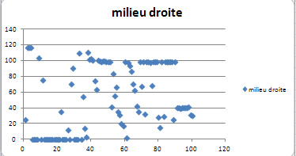
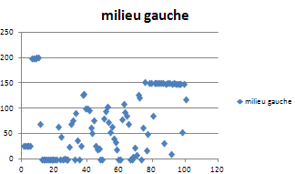
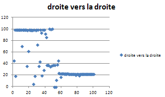
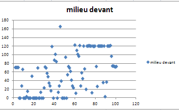

# DaguCP

Robot Dagu de Clément, réalisé pendant le stage en entreprise

## Connexions électriques

La carte Arduino utilisée est assimilable à une carte Nano 328.

La led bleue est disponible sur la pin 13.

Chenille gauche :

  - Encodeur A   --> Arduino Pin 2
  - Encodeur B   --> Arduino Pin 5
  - Moteur       --> Arduino motor 1 (marche avant pin 7, marche arrière pin A4, PWM pin 9)

Chenille droite :

  - Encodeur A   --> Arduino Pin 3
  - Encodeur B   --> Arduino Pin 4
  - Moteur       --> Arduino motor 2 (marche avant pin 8, marche arrière pin A5, PWM pin 10)
  
Servo branché sur la pin 12

Emetteur d'ultra-sons :

  - Trig        --> Arduino Pin 11
  - Echo        --> Arduino Pin 6  

Joystick :

  - Axe x       --> Arduino Pin A1 (0 to 1024)
  - Axe y       --> Arduino Pin A2 (0 to 1024)
  - Button      --> Arduino Pin A3 (HIGH/LOW)

## Analyse des distances
Le capteur ultrason est très bruité et beaucoup de ses valeurs sont erronées. j'ai donc effectué des mesures dans differentes positions du robot afin de mieux comprendre les réactions du capteurs. 

### Position 1

Au vu des courbes on en déduit que le capteur détecte clairement un obstacle entre 20 et 200 cm. En dehors de ces valeurs, l'obstacle peut être détécté mais le bruit empêche le robot de prendre des décisions intelligentes. De plus, si l'echo de l'ultrason ne revient pas au bout d'une seconde (*timeout*) le capteur renvoi une distance de 0cm. Dans ce cas la, le programme devra considerer cette valeur comme un espace libre devant le robot.

## Fonctionnement des moteurs
Le robot dispose de deux moteurs qui controle les deux chenilles. On constate que les moteurs n'ont pas assez de courant pour faire tourner les chenilles en dessous de 15% de la tension nominale des moteurs à cause des frottements. Le programme fixera donc un seuil de vitesse à 15%. en deesous de ce seuil il renverra une vitesse de 0.
## Servo moteur
Le robot possède une tête composé du capteur ultrason mais aussi d'un servo moteur pour faire tourner afin d'effectuer le mesures de distances.
Le servo à un angle de rotation de 180° mais les mesures ne seront prises qu'aux angles 0°, 90° et 180°. 
## Algo

  
## Utilisation

Au démarage, le robot est en Mode STOP. On le voit grâce à la led qui clignote.

Pour passer en mode AUTO, tirer le joystick vers l'arrière du rover, la led s'éteind, attendre qu'elle se rallume puis relacher le joystick.
        
A tout moment, un mouvement du joystick fait basculer le robot en mode STOP.

        

