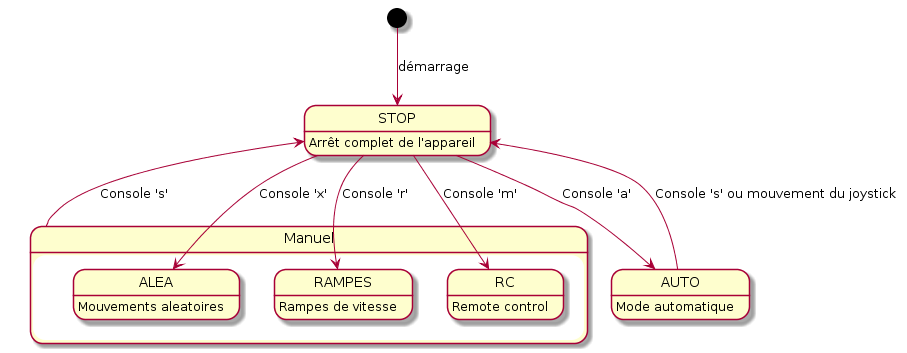

Title:   Liste des exigences
Author:  Baptiste PIERARD (Médiane Système)
Date:    13 juin 2017

Introduction
==============

Ce document constitue la liste des exigences applicables au robot *DaguCP* développé par Clément Pénicaut lors de son stage de découverte de l'entreprise, au sein de Médiane Système.

Exigences
===============

Fonctionnement général
------------------------

**EXG_GENE_01** : Le robot doit être développé sur la plateforme matérielle fournie : robot Dagu, carte Arduino, servo et capteur ultrason HC-SR04.

**EXG_GENE_02** : Le robot doit être alimenté par 6 batteries rechagables Ni-MH

Sécurité
----------

**EXG_SECU_01** : A la mise sous tension, le robot ne doit pas bouger (servo ET chenilles).

**EXG_SECU_02** : Quelque soit le mode de fonctionnement, l'envoi d'un ordre d'arret immédiat doit être possible. Sur reception de cet ordre, le robot doit s'arreter immédiatement, et couper la puissance des moteurs.

Modes de fonctionnement
-------------------------

### Transitions entre les modes de fonctionnement

**EXG_TRAN_01** : Les transitions entre les modes doivent respecter le schema suivant 

### Mode "Stop"

**EXG_STOP_01** : Le robot doit couper ses moteurs, arreter de bouger ses chenilles et le servo. 

### Mode "Manuel"

**EXG_MANU_01** : Le robot doit appliquer les ordres de mouvements envoyés grâce à la console ou grâce à un téléphone via le module bluetooth.

**EXG_MANU_02** : Le robot doit pouvoir, sur demande de l'utilisateur, faire des mesures sur son evironement grâce au capteur ultrason dans les differentes directions.

### Mode "Pilotage automatique"

**EXG_AUTO_01** : Le robot doit pouvoir se déplacer librement en évitant les obstacles.
 
**EXG_AUTO_02** : Le robot doit pouvoir mesurer la distance entre lui et les obstacles grâce au capteur ultrason. 

### Mode "Rampe"

**EXG_RAMP_01** : Le robot doit effectuer des rampes de vitesse (augmenter sa vitesse puis la diminuer en passsant par l'arrêt.)

### Mode "Aléatoire"

**EXG_ALEA_01** : Le robot doit effectuer des mouvements aleatoires.

